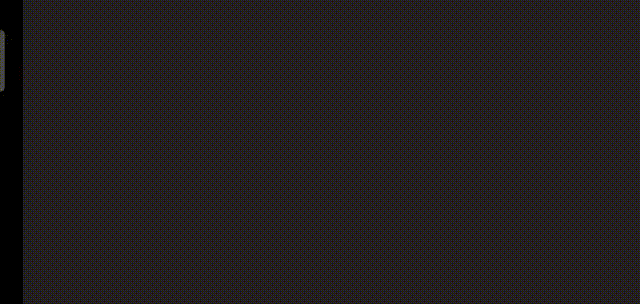

<!-- ABOUT THE PROJECT -->
<h1 align="center">Soldier Of Fortune</h1> 

<h5 align="center">
Repository For Soldier Of Fortune
</h5>

Soldier Of Fortune tells the story of a mercenary or what we usually know as a mercenary who is trapped in a room in a mysterious tower. Players are asked to run mercenaries looking for a way out of the room. This game is a step-by-step dungeon crawler, where the torch that the mercenary carries only illuminates a few tiles in front of it which means the mercenary must walk to avoid traps and terrible monsters that suddenly appear out of nowhere. When mercenaries see monsters, players can use torches to their advantage. When the torch lit, the monster immediately ran to the location of the mercenary. On the other hand, when the torch dies, the monster will stay where it is. So players are advised to turn off the torch, run around some traps, relight the torch and watch the monster run towards the trap. However, when the torch dies, the player cannot see the trap. So when the player first explores, the player is required to memorize the area of ​​the room, so that when the mercenary is chased by an angry monster, the mercenary can safely run through all the hidden traps and then light the torch again to lure the monster into the trap. Here is link to download the game: https://chessporg.itch.io/soldier-of-fortune

## Built with

- [Unity](https://developer.android.com/studio/)
- [Fmod](https://www.fmod.com/)
- [DoTween](http://dotween.demigiant.com/)
- [Gesture Recognizer](https://assetstore.unity.com/packages/tools/input-management/gesture-recognizer-86410)

### Demo
Splash Screen |
--- |
 |

Menu |
--- |
 |

Tutorial |
--- |
 |

## Getting Started

### Prerequisites

There are several conditions before you can clone this project:
- [Unity](https://developer.android.com/studio/)
- [Github Api Key](https://github.com/settings/tokens)

### Installation

Creating a token (if you didn't have yet) by reading [this documentation](https://docs.github.com/en/authentication/keeping-your-account-and-data-secure/creating-a-personal-access-token). When done, follow the steps below:
1. Clone the repo https://github.com/FikranAkbar/Bizitza.git
2. Build the project
3. And you're good to go.

<!-- CONTRIBUTING -->
## Contributing

Contributions are what make the open source community such an amazing place to be learn, inspire, and create. Any contributions you make are **greatly appreciated**.

1. Fork the Project
2. Create your Feature Branch (`git checkout -b feature/AmazingFeature`)
3. Commit your Changes (`git commit -m 'Add some AmazingFeature'`)
4. Push to the Branch (`git push origin feature/AmazingFeature`)
5. Open a Pull Request

<!-- CONTACT -->
## Contact

Gmail - fikranakbar756@gmail.com
Linkedin - [Fikran Akbar](https://www.linkedin.com/in/fikran-akbar-1ab958169/)
